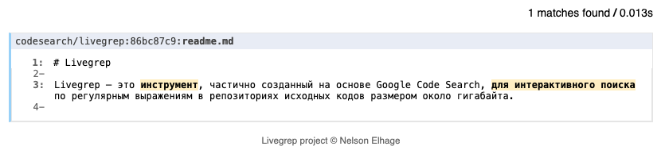
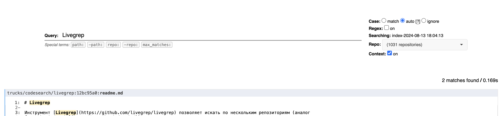

# Поднимаем свой поиск по коду



Всем привет!

Сегодня хочу поделиться решением проблемы поиска по коду. Статья будет полезна пользователям систем контроля версий в средних и маленьких компаниях, а также для понимания интересных подходов к ее решению.

## История возникновения потребности поиска по коду

Я работаю в компании [ati.su](https://job.ati.su/), несколько лет назад у нас начался активный процесс распила монолита на микросервисы. Вскоре появилась необходимость в поиске по нескольким репозиториям одновременно. Эта проблема стала особенно острой, когда количество репозиториев стало расти, и возникла потребность вносить крупные изменения, затрагивающие несколько проектов.

## Решение на хакатоне: сервис «Спутник»

Одним из решений, разработанных на одном из корпоративных хакатонов, стал сервис «Спутник». Он не только позволял искать по коду, но и обеспечивал поиск по другим сервисам в компании. Под капотом «Спутник» работает так: сервис ежедневно проходит по всем информационным ресурсам (Confluence, GitLab, Kaiten и т.д.), вычитывает данные через их API и кладет в Elasticsearch. Для Slack мы использовали его поисковое API. Сейчас сервис выглядит так:


## Проблема поиска по коду и следующий шаг к ее решению

Хотя «Спутник» отлично справляется с общими задачами поиска, поиск по коду — это особая задача, и обычный полнотекстовый поиск начинал не справляться. Иногда оставалось чувство, что ты нашел не все и что-то не попало в индекс. Один из моих коллег посоветовал [Livegrep](https://github.com/livegrep/livegrep) — инструмент для поиска по коду с поддержкой регулярных выражений, попробовать его можно [по ссылке](https://livegrep.com/search/linux). 

## Почему Livegrep?

Livegrep подходит для работы с репозиториями, чей объем достигает гигабайта. Это полезно в нашем случае, когда нужно быстро искать код по множеству репозиториев (у нас уже больше тысячи активных проектов). Также он поддерживает фильтрацию по типу файла, иерархию проектов, что позволяет нам фильтровать проекты по командам и другие удобные функции.

## Подготовка к развертыванию

На просторах интернета мало информации об использовании Livegrep. Это и побудило меня написать данную статью. Ряд примеров упоминают интеграцию с GitHub, который и так неплохо умеет искать по нескольким репозиториям. Мне посчастливилось найти issue, где упоминалась поддержка других систем контроля версий, и я интуитивно начал развертывать систему.


> Однажды Эрнест Хемингуэй поспорил, что напишет самый короткий поисковый запрос, способный растрогать любого.

### Цель

Проиндексировать все проекты в GitLab и предоставить доступ к поиску «отделам разработки».

### Сложности

1. Используемый модуль сам не реиндексируется.
2. В DockerHub свежие образы не пушились уже 3 года (в них нет `livegrep-fetch-reindex` нужного модуля).
3. Для `livegrep-fetch-reindex` нужен конфигурационный файл с метаданными по репозиториям.

## Разворачиваем Livegrep

1. **Делаем форк [проекта](https://github.com/livegrep/livegrep)**, правим пайплайн, чтобы свежий image попал к нам в репозиторий ([моя конфигурация](https://github.com/gently-whitesnow/livegrep/blob/main/.github/workflows/ci.yaml)). Это необходимо для получения свежих образов.  
   Не забудьте задать в проекте переменные:  
   `DOCKER_HUB_USERNAME`
   `DOCKER_HUB_PASSWORD`  

2. **Рекомендую после этого скачать образ из публичного репозитория и загрузить во внутреннюю сеть.**

3. Наш ориентир — пункт **"[Local repository browser](https://github.com/livegrep/livegrep?tab=readme-ov-file#local-repository-browser)"** из readme проекта.  
Нам необходимо использовать `livegrep-fetch-reindex` вместо `livegrep-github-reindex`, так как он поддерживает интеграцию с другими системами контроля версий.  
Доступные флаги модуля с описанием можно найти по [ссылке](https://github.com/livegrep/livegrep/blob/master/doc/flags.md).

Для этого модуля пишем скрипт, который соберет для нас конфигурационный файл [`IndexConfig`](https://github.com/livegrep/livegrep/blob/main/server/config/config.go#L61).

**Пример main.py**  
```python
import os
import gitlab
import json
import pytz
from datetime import datetime

domain = os.getenv('GITLAB_DOMAIN')
token = os.getenv('GITLAB_PRIVATE_TOKEN')
login = os.getenv('GITLAB_LOGIN')

if not token:
    raise ValueError("Token environment variable are not set")

if not domain:
    raise ValueError("Domain environment variable are not set")

if not login:
    raise ValueError("Login environment variable are not set")

base_url_with_auth = f'https://{login}:{token}@{domain}'

gl = gitlab.Gitlab(domain, private_token=token)

groups = gl.groups.list(all=True)

moscow_tz = pytz.timezone('Europe/Moscow')
configuration = {
    "name": f"index-{datetime.now(moscow_tz).strftime('%Y-%m-%d %H:%M:%S')}",
    "repositories": []
}

projects_set = set()
for group in groups:
    # Получаем все проекты группы и оставляем только подходящие под наши условия (приватности)
    projects = group.projects.list(get_all=True)
    for project in projects:
        # только активные и открытые проекты (необязательное условие, если в токене заложены ограничения)
        if project.archived or project.visibility == 'private' or project.can_create_merge_request_in == False:
            continue

        # проверка уникальности проектов (например скринеры безопасности есть во многих группах)
        if project.path_with_namespace in projects_set:
            continue
        projects_set.add(project.path_with_namespace)

        # Формирование конфигурацию под каждый репозиторий
        repo_config = {
            # путь к папке, все изначально клонируется в WORKDIR докерфайла
            "path": project.name, 
            # имя репозитория, включая родительские папки (позволяет настроить фильтрацию по командам)
            "name": project.path_with_namespace, 
            # индексируемая ветка
            "revisions": [project.default_branch], 
            "metadata": {
                # паттерн который будет применятся для редиректа в гитлаб
                "url_pattern": f"{project.web_url}/-/blob/{project.default_branch}/{{path}}#L{{lno}}",
                # путь для скачивания репозитория
                "remote": base_url_with_auth + project.web_url.replace(f'https://{domain}', '')
            }
        }
        configuration["repositories"].append(repo_config)

with open("configuration.json", "w") as f:
    json.dump(configuration, f, indent=4)
```
Этот скрипт достаточно простой и может быть доработан для исключения некоторых проектов или групп.

4. **Запускать скрипт мы будем на этапе билда докер образа**, результат выполнения будем копировать в общую папку:  
**Пример Dockerfile.index**  
```dockerfile
FROM gently4005/livegrep-base:latest as builder

WORKDIR /

COPY main.py requirements.txt /

ARG GITLAB_DOMAIN
ARG GITLAB_PRIVATE_TOKEN
ARG GITLAB_LOGIN

# ставим зависимости и вызываем наш скрипт
RUN apt-get update  \
    && apt-get install -y python3-pip git \
    && pip3 install -r requirements.txt  \
    && python3 /main.py  \
    && mkdir -p /data 

# папка, куда будут клонироваться репозитории перед индексацией
WORKDIR /clone_root

# копируем конфигурацию в общую папку, так как она нужна не только для индексации
# запускаем индексацию
# -out путь к готовому индексу
# -skip-missing пропускать репозитории, в которых отсутствует указанная ревизия
# -num-workers количество потоков для индексации (по умолчанию 8)
# -reload-backend перезагружать бэкенд после индексации, чтобы он подтянул конфигурацию (очень полезная настройка)
CMD ["/bin/sh", "-c", "\
    cp -rf /configuration.json /data/configuration.json && \
    /livegrep/bin/livegrep-fetch-reindex -out /data/index.idx -skip-missing -num-workers 4 -reload-backend livegrep-backend-linux:9898 /data/configuration.json"]
```

5. **Для обмена конфигурацией и индексом между контейнерами**, а также для обработки внутренних запросов, создаем необходимые ресурсы:  
```bash
docker volume create livegrep-data  
docker network create livegrep-network
```
**Пример docker-compose-index.yml**  
```yaml
version: '3.9'

services:
  livegrep_generate_config:
    build:
      context: .
      dockerfile: Dockerfile.index
      args:
        GITLAB_DOMAIN: ${GITLAB_DOMAIN}
        GITLAB_PRIVATE_TOKEN: ${GITLAB_PRIVATE_TOKEN}
        GITLAB_LOGIN: ${GITLAB_LOGIN}
    image: ${REPOSITORY:-your-local-docker-registry/livegrep_generate_config}:${UNIQUE_VERSION:-latest}
    volumes:
      - livegrep-data:/data
    logging:
      driver: json-file
      options:
        max-file: 10
        max-size: 10m
    deploy:
      resources:
        limits:
          memory: 2G
          cpus: "2"
    networks:
      - livegrep-network

volumes:
  livegrep-data:
    external: true

networks:
  livegrep-network:
    external: true
```

6. **Создаем два файла для CI/CD**, чтобы автоматизировать процесс билда и деплоя индекса:  
**ci/build-index.yml**  
```yaml
.build_tpl: &index_definition
  stage: build-index
  interruptible: true
  rules:
    - if: '$IS_SCHEDULE'
      when: always
    - when: manual
  script:
    - UNIQUE_VERSION=$CI_COMMIT_REF_SLUG docker-compose -f docker-compose-index.yml pull --ignore-pull-failures
    - docker-compose -f docker-compose-index.yml build --no-cache
    - docker login -u $REGISTRY_LOGIN -p $REGISTRY_PASS $REGISTRY
    - docker-compose -f docker-compose-index.yml push

generate-index:
  <<: *index_definition
  artifacts:
    paths:
      - docker-compose-index.yml
    expire_in: 1 day
```
**ci/deploy-index.yml**  
```yaml
.build_tpl: &index_definition
  stage: deploy-index
  interruptible: false
  tags:
    - deploy
  rules:
    - if: '$IS_SCHEDULE'
      when: always
    - when: manual
  dependencies:
    - generate-index
  script:
    - docker -H $DOCKER_HOST login -u $REGISTRY_LOGIN -p $REGISTRY_PASS $REGISTRY
    - docker-compose -H $DOCKER_HOST -f docker-compose-index.yml pull
    - docker-compose -H $DOCKER_HOST -f docker-compose-index.yml down
    - docker-compose -H $DOCKER_HOST -f docker-compose-index.yml up -d --force-recreate
    - touch ${CI_PROJECT_DIR}/success
    - docker -H $DOCKER_HOST system prune -f


deploy-index:
  <<: *index_definition
  variables:
    DOCKER_HOST: tcp://your-server-with-docker-host:2375/
```
Обратите внимание на переменную `$IS_SCHEDULE`. С её помощью можно настроить регулярную переиндексацию кода, например, ежедневно или ежечасно, в зависимости от объема репозиториев.

7. **Настраиваем docker-compose-livegrep.yml** для развертывания backend и frontend компонентов Livegrep.  
**Пример файла:**  
```yaml
version: '3.9'

services:
  livegrep-backend-linux:
    image: "gently4005/livegrep-base:latest"
    command:
      - "/livegrep/bin/codesearch"
      - "-load_index=/data/index.idx"
      - "-threads=4"
      # необходимые настройки для перезагрузки индекса и взаимодействия внутри сети
      - "-grpc=0.0.0.0:9898"
      - "-reload_rpc" 
    volumes:
      - livegrep-data:/data
    networks:
      - livegrep-network
    logging:
      driver: json-file
      options:
        max-file: 10
        max-size: 10m
    restart: unless-stopped

  livegrep-frontend:
    image: "gently4005/livegrep-base:latest"
    command:
      - "/livegrep/bin/livegrep"
      - "-docroot"
      - "/livegrep/web/"
      - "-listen"
      - "0.0.0.0:8910"
      - "-connect"
      - "livegrep-backend-linux:9898"
      - "/data/configuration.json"
    volumes:
      - livegrep-data:/data
    networks:
      - livegrep-network
    logging:
      driver: json-file
      options:
        max-file: 10
        max-size: 10m
    restart: unless-stopped

  nginx:
    build:
      context: .
      dockerfile: Dockerfile.nginx
    ports:
      - "8841:80"
    networks:
      - livegrep-network
    logging:
      driver: json-file
      options:
        max-file: 10
        max-size: 10m
    restart: unless-stopped

volumes:
  livegrep-data:
    external: true

networks:
  livegrep-network:
    external: true
```
Использование Nginx не обязательно, но его можно использовать для авторизованного доступа внутри корпоративной сети.

8. Ознакомиться со всем кодом проекта можно на **[GitHub](https://github.com/gently-whitesnow/livegrep-article)**. Его совсем немного, и большая часть уже была представлена в статье.  


## Заключение

Теперь в русскоязычном сообществе появилась практическая инструкция по развертыванию Livegrep. Понимаю, что предложенный подход может быть не идеальным и может не охватывать все возможные аспекты, однако он решает основную задачу — предоставляет удобный поиск по коду в условиях множества репозиториев.



## Вопрос к читателю

Должен ли весь продуктовый код быть доступен каждому сотруднику «отдела разработки», либо необходимо обеспечивать доступ только к репозиториям своей команды и общих библиотек?

Думаю, что от слива исходников это не спасает, а лишь затрудняет обмен знаниями между сотрудниками.

## Интересные ошибки

1. **Ошибка с `dev/null`**: Изначально я начал клонировать репозитории в корневую папку контейнера `/`. В одном из репозиториев был проект с именем `dev`, и при индексации вылетала ошибка, связанная с обращением к `dev/null`. Только после долгих поисков я понял, что это связано с путями в Unix-системах, и это сбило меня с толку.

2. **Старые образы в Docker Hub**: Я не сразу заметил, что образы в Docker Hub не обновлялись три года. Из-за этого долго не мог понять, почему в локальной сборке присутствуют нужные модули, а в контейнере их нет.

3. **Ошибка подхода к индексированию**: Изначально у меня не получалось авторизоваться в GitLab модулем индексирования, что направило меня на путь формирования индекса на этапе билда. Мне повезло, что образ на 40 ГБ не влез к нам в Docker Registry (где-то вздохнул один девопс), это заставило меня разобраться чуть глубже.
